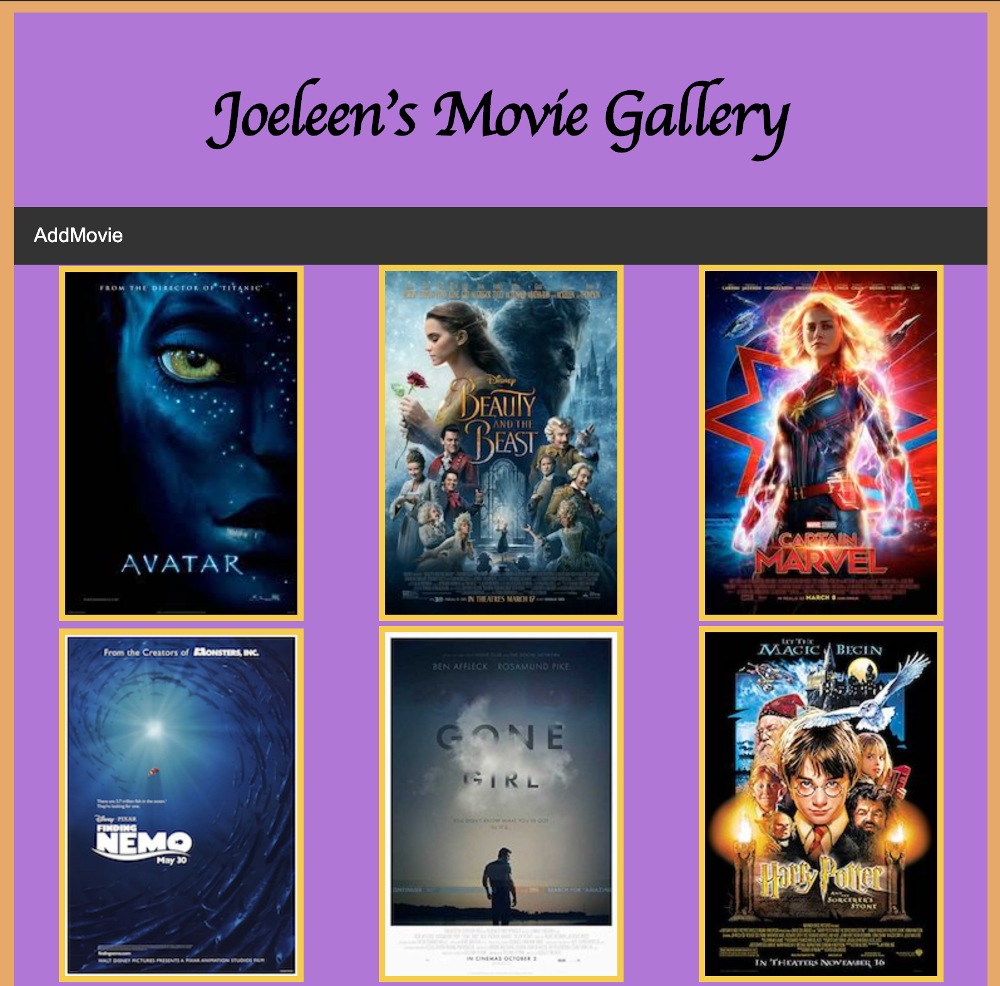

# MOVIE SAGAS

_Duration: 20 hr_

You love movies. Enjoy the classic movies of our generation. I present to you the Movie saga. Immerse yourself in movies as you peruse my gallery of quality movie posters. Delve deeper: read fannatical information about your film of quander. Even add to the collection. Promote your own timeless classic.



### Prerequisites

- [Node.js](https://nodejs.org/en/)
- [React.js](https://reactjs.org/)
- [Redux-Saga](https://redux-saga.js.org/)

## Installation

Create your database and tables using the provided `data.sql` file. Start the server.

```
npm install
npm run server
```

Now that the server is running, open a new terminal tab with `cmd + t` and start the react client app.

```
npm run client
```

## Movie-Time!

1. The Home Page is a Movie Post Gallery. 
    --SEE the movie you like and click on it.
2. Read about the movie as you feel the vibes of a virtual film festival.
3. click `Back to Gallery` to return to the Poster Gallery.
4. From the Gallery Page, click `Add Movie` to be directed to a form.
5. Fill the input fields with information about your movie and click `Submit` to add your favorite to the realm of classics.

## Acknowledgement
Thanks to [Prime Digital Academy](www.primeacademy.io) who equipped and helped me to make this application a reality. Thank you https://github.com/sdeda1us and https://github.com/jposeyjr: Our partnerships in troubleshooting pushed me forward on this project.

## Support
If you have suggestions or issues, please email me at [jkado@my.hpu.edu](www.google.com)